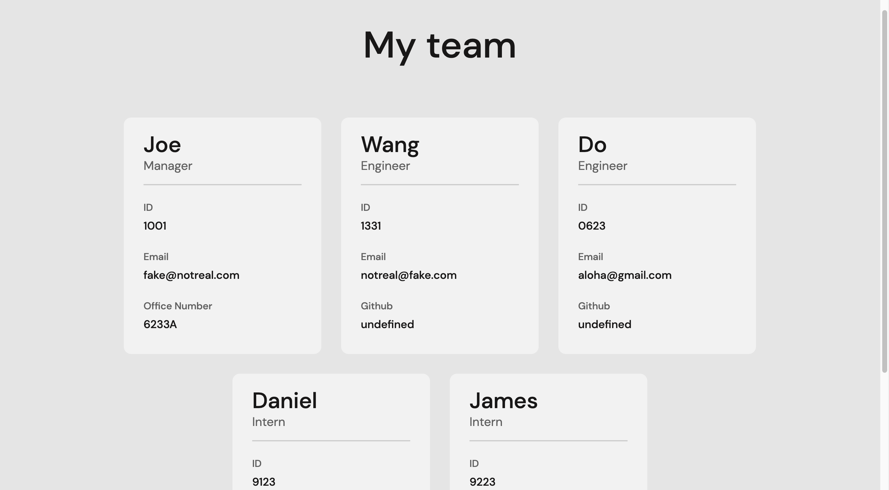

# Team Profile Generator v1

The Team Profile Generator (TPG) is an application that is designed for project managers who want to have a resource to find all of their team members' contact links in one spot. 

## Installation

As a command-line application, there is no front end and thus it is not deployed anywhere. However, the application can still be run on your personal computer. 

Please note that these instructions will require an [SSH Key](https://docs.github.com/en/authentication/connecting-to-github-with-ssh/adding-a-new-ssh-key-to-your-github-account) for GitHub, as well as [NodeJS](https://nodejs.org/en/download/). 

1. Follow this [link](https://github.com/jhahnsheen/Team-Profile-Generator-v1) to the repository containing the code.

2. Locate the 'Code' button located under the nav bar and to the immediate left of the 'About' aside. Click and select SSH and copy the clone link.

3. Open your terminal on your computer and navigate to the location where you want to clone the repo. Type in the command 
```bash
git clone git@github.com:jhahnsheen/Team-Profile-Generator-v1.git
```

4. Open the cloned git file in your IDE and terminal. 

5. Run the npm installation command
```bash
npm install 
```
6. Run the node start command
```
npm run start
```
7. Optional: run some tests by running the test script
```
npm run test
```

## Features

The TPG allows the user to categorize each employee by their job title and to store different fields for each team member based on their position. 

Once all of the fields are filled out, the application will then generate an HTML page that contains all of the information that the user inputs. 

The generated HTML will look like the example below.



## Usage

A video showing the functionality of the application can be found [here](https://drive.google.com/drive/folders/1B6p8Sx0bYxyalqSKfYltxMotXecdCBTY?usp=sharing)

## Contributions

This project is closed for contributions and is meant to be used to educational purposes only. 